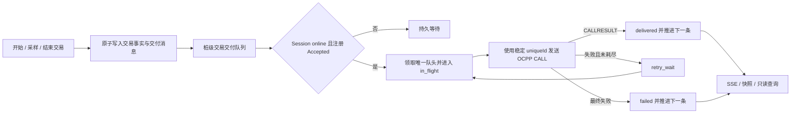

# 离网交易与持久交付实施计划

协议事实见 [OCPP 离网交易与断线补发：协议事实](./research/ocpp-offline-protocol-facts.md)，架构决策见 [ADR-0032](./adr/0032-persistent-station-transaction-delivery-queue.md)。本计划仅实现 OCPP 1.6J。

## 成功标准

1. WebSocket 断开时，经过本地授权的交易可以开始、产生周期采样并结束；每个动作在 API 返回成功前，与对应交付消息原子持久化。
2. 同一桩实例的 `StartTransaction`、交易内 `MeterValues` 和 `StopTransaction` 按持久化生成序号串行交付；多枪重叠交易也不会按“整笔交易”错误分组补发。
3. 未确认消息、稳定 `uniqueId`、尝试次数和重试时间跨 Actor、服务重启及重新部署恢复。
4. 普通重连后立即恢复队列；进程重启后只在新的 Boot Accepted 后恢复。
5. 重试严格使用 `TransactionMessageAttempts` 和 `TransactionMessageRetryInterval`；最终失败留痕并继续队列。Start 最终失败后，后续消息使用 `transactionId=-1`。
6. Local Authorization List 和 Authorization Cache 跨重启保留，并继续执行列表优先、明确无效必须拒绝、未知标识受配置控制的规则。
7. 调试台可只读观察队列摘要和逐项状态；OpenAPI 包含新接口和重要中文说明。

## 不在本次范围内

- OCPP 2.0.1 `TransactionEvent`、`seqNo`、`offline` 字段或 `GetTransactionStatus`。
- 新增 clock-aligned 采样调度器；本次只接入 Runtime 已生成的周期 `MeterValues`。
- 扩展 `StopTransaction.transactionData` 聚合、降采样或容量压缩。
- 全 OCPP 消息 outbox；Heartbeat、Authorize、StatusNotification 等非交易消息继续走现有 Session。
- 应用层队列硬上限、手动跳过、删除、改序、重放或无限重试。
- 应用层静态加密和新的登录授权模型；新接口不得额外暴露 idTag 或领域 payload。

## 当前差距

- `MemoryOfflineTransactionOutbox` 以进程内 `Map` 保存待发事实，服务重启即丢失。
- `offlineTransactionReplay` 先完整回放一笔交易再处理下一笔，只保证单交易内部顺序。
- Runtime 仅在 Boot Accepted 或 Heartbeat 成功后尝试 replay，普通重连可能多等一个心跳周期。
- Session 每次请求自行生成 UUID，调用方不能复用持久化消息标识。
- `TransactionMessageAttempts` 和 `TransactionMessageRetryInterval` 已在配置目录并持久化，但 Runtime 未消费。
- 活动交易与采样已持久化，离线 outbox、本地授权列表和授权缓存仍在内存；交易写入与 outbox 写入也不是一个数据库事务。
- 已结束交易 7 天清理会连带删除采样，尚不知道它们是否仍有待交付消息。

## 目标结构



依赖方向保持 `packages/charging-point-actor` 定义领域模型、状态机和异步持久化端口，`apps/server` 使用 Drizzle/PostgreSQL 实现端口。Actor 包不得依赖 Hono、Drizzle 或数据库 schema。

## 数据模型

### `transaction_delivery_sequences`

每个桩实例一行，用行锁原子分配提交顺序，避免两个并发数据库事务取得序号后反序提交。

| 字段 | 说明 |
| --- | --- |
| `charging_point_id` | 主键并外键关联桩实例 |
| `next_sequence` | 下一可分配的正整数序号 |
| `updated_at` | 最近分配时间 |

分配序号与插入业务事实、交付消息在同一事务中完成；失败事务可以留下序号间隙，但不得产生倒序或复用。

### `transaction_delivery_messages`

| 字段 | 说明 |
| --- | --- |
| `id` | 内部 UUID 主键 |
| `charging_point_id` | 所属桩实例 |
| `transaction_record_id` | 关联 `charging_transactions.id` |
| `delivery_sequence` | 单桩最终发送顺序 |
| `message_id` | 持久化 OCPP `uniqueId`，全局唯一 |
| `message_type` | `start`、`meter_value`、`stop` |
| `payload` | 按类型校验的领域 JSON，不是原始 OCPP 帧 |
| `occurred_at` | 原始业务时间，写入 OCPP payload |
| `status` | `pending`、`in_flight`、`retry_wait`、`delivered`、`failed` |
| `attempt_count` | 已进入 `in_flight` 的总次数 |
| `next_attempt_at` | `retry_wait` 的到期时间 |
| `in_flight_at` | 最近一次领取时间，用于重启恢复 |
| `delivered_at` / `failed_at` | 终态时间 |
| `last_error_code` / `last_error_message` | 最近失败诊断，不保存任意敏感 headers |
| `created_at` / `updated_at` | 记录时间 |

约束与索引：

- 唯一约束 `(charging_point_id, delivery_sequence)` 和 `message_id`。
- `(charging_point_id, status, next_attempt_at, delivery_sequence)` 支持领取队头和到期重试。
- 同一桩只领取最小的非终态序号；不得使用 `SKIP LOCKED` 越过队头。
- `payload` 在写入和读取时都通过判别联合 schema 校验：
  - `start`：OCPP connector、idTag、meterStart、startedAt、reservationId；
  - `meter_value`：meterWh、sampledAt、readingContext、电流/电压/功率；
  - `stop`：meterStop、stoppedAt、reason、可选 idTag。

### 本地授权表

新增列表元数据、列表条目和缓存条目三类表，身份均包含 `charging_point_id + protocol`：

- Local Authorization List 元数据保存版本、来源和更新时间；条目保存 idTag、状态、过期时间和 parentIdTag。
- Authorization Cache 按 idTag 与 EVSE 保存最新状态、过期时间、parentIdTag 和最近评估时间，以保持现有 OCPP 1.6 Runtime 的枪口授权语义。
- `SendLocalList` 的 full/differential 更新、`ClearCache` 以及协议响应引起的缓存变化必须先写数据库，再替换 Actor 内存状态。
- 不新增读取或编辑 idTag 的公开管理 API；删除桩实例时一并清理。

### 现有交易表

- 保留 `charging_transactions.ocpp_transaction_id` 可空。Start CALLRESULT 返回后写入 CSMS ID；Start 最终失败时写入 `-1`。
- 开始、采样、结束写入分别与对应交付消息共用一个数据库事务。
- 交易业务状态不复用交付状态；本地 `active/ended` 与消息 `pending/delivered/failed` 可以独立组合。

## Actor 持久化端口

升级现有 `ChargingPointActorTransactionStore`，使它暴露原子用例，而不是让 Runtime 依次调用两个互不相关的 store：

- 加载活动交易、交易绑定、非终态交付消息及交付摘要；
- 原子开始交易并入队 `start`；
- 原子保存采样并入队 `meter_value`；
- 原子结束交易并入队 `stop`；
- 领取严格队头、安排重试、标记成功或最终失败；
- 原子处理 Start 成功绑定或 `-1` fallback；
- 恢复遗留 `in_flight`。

新增本地授权持久化端口，加载/替换列表、读写/清除缓存。生产端口由 `apps/server` 的 PostgreSQL repository 实现；Actor 单元测试使用内存实现。

## 交付状态机

### 入队

1. Runtime 先完成连接器和授权校验。
2. 为领域动作构造并校验类型化 payload 与稳定 UUID。
3. PostgreSQL 事务锁定单桩序号行，取得一个或多个连续序号。
4. 在同一事务写入交易/采样变化和交付消息。
5. 提交后更新 Actor 内存投影、发布领域事件并唤醒调度器；事务失败则不修改内存，也不返回成功。

所有交易消息都走该路径。在线无积压只意味着调度器会立即发送，不意味着绕过交付表。

### 领取与发送

1. 只有 Session online 且注册状态为 Accepted 时才查队头。
2. `retry_wait.next_attempt_at` 尚未到期时设置单个可取消 timer；没有连接时不创建尝试。
3. 到期队头通过条件更新进入 `in_flight`，同时递增 `attempt_count` 并写 `in_flight_at`。
4. 按领域 payload 和当前交易绑定构造 OCPP request；Session 使用交付消息的持久 `message_id`。
5. 同一桩任意时刻最多一个交易消息 in flight。非交易 Session 请求不受此限制。

Session 的 `request` 增加可选调用方 `messageId`，默认行为仍生成随机 UUID，避免影响其他调用方。校验必须拒绝空 ID，并确保一次新 CALL 不复用其他交付消息的 ID。

### 结果映射

| 结果 | 状态变化 |
| --- | --- |
| OCPP `CALLRESULT` | 标记 `delivered`，清除重试字段并处理响应副作用 |
| `StartTransaction.conf` 非 Accepted | 消息仍是 delivered；保存返回的 transactionId，再按 `StopTransactionOnInvalidId` 等配置处理本地交易 |
| OCPP `CALLERROR` | 本次失败；未耗尽则进入 `retry_wait`，否则 `failed` |
| 响应 timeout、发送中断或断线 | 结果未知但本次已计数；使用相同 messageId 重试或进入 failed |
| 发送前发现 Session offline | 不领取、不计数，等待重连 |
| 本地 payload/schema 不可构造 | 直接 `failed` 并记录实现错误，不做协议重试 |

失败后的等待为：

```text
TransactionMessageRetryInterval × attempt_count
```

每次失败时读取当前持久协议配置。若 `attempt_count >= TransactionMessageAttempts`，立即进入 `failed`；配置在积压期间改变时，从下一次状态推进起生效。

Start 进入 `failed` 且尚无 CSMS transactionId 时，在同一事务把交易绑定设为 `-1`。后续消息不得在 Start 仍处于 `pending/in_flight/retry_wait` 时提前使用 `-1`。

### 恢复与触发

调度器由以下事件幂等唤醒：

- 新交易消息提交；
- 普通 WebSocket 重连进入 online；
- 新 Actor 的 Boot Accepted；
- retry timer 到期；
- 当前队头进入 delivered 或 failed；
- Heartbeat 成功仅作为安全唤醒，不承担主要重试时钟。

Actor 启动时，先加载本地授权信息、交易与交付状态，再连接和 Boot。遗留 `in_flight` 已经消耗过一次尝试，恢复为到期重试或最终失败，不再次递增；Boot Pending/Rejected 时保持冻结。

## API、OpenAPI 与事件

### Contracts

在 `@spark-bee/contracts` 增加：

- `TransactionDeliveryStatus`、`TransactionDeliveryMessageType`；
- start/stop 响应的 `deliveryStatus`，并允许 `ocppTransactionId` 为空或为 `-1`；
- `TransactionDeliverySummary`；
- 分页列表 item、cursor、状态和类型筛选 schema；
- `transaction-delivery.changed` SSE 事件 schema。

字段说明使用中文 Zod metadata。

### HTTP

新增：

```text
GET /api/charging-points/{id}/transaction-deliveries
```

- 支持 `cursor`、`limit`、`status`、`messageType`；默认和单页上限均为 200。
- 页面查询按 `deliverySequence` 倒序展示，cursor 使用该序号；这不改变调度器升序交付。
- 响应不返回 idTag、完整 payload 或认证信息，只返回调试需要的资源 ID、序号、类型、状态、尝试和错误摘要。
- route 的 `summary`、`description`、响应说明使用中文；测试断言路径和重要说明存在于 `/openapi.json`。

现有 runtime snapshot 增加：`pendingCount`、`retryWaitCount`、`failedCount`、`inFlight` 和 `oldestPendingAt`。开始和停止交易 API 成功仅表示本地状态已提交，响应明确返回当前交付状态。

### SSE

新增 `transaction-delivery.changed`，至少包含桩 ID、消息 ID、本地交易 ID、序号、类型、旧/新状态、尝试次数、下次重试时间、错误摘要和发生时间。它进入现有协议事件观察记录，但数据库交付表仍是恢复事实来源。

## 前端

- 在单桩运行调试台增加“交易交付”页签，复用 shadcn/ui Table、Badge、Tabs 和现有虚拟列表/分页模式。
- 顶部摘要展示待交付、重试等待、失败数和最老积压时间。
- 列表展示全局序号、消息类型、本地/OCPP 交易 ID、状态、尝试次数、下次重试、最后错误和发生时间。
- HTTP 首次加载与 SSE 增量按消息 ID 合并；筛选改变时重置 cursor，页签切换保留已加载范围。
- 开始/停止成功提示改为“本地交易已开始/结束，等待 CSMS 交付”，不得把 `pending` 表述为 CSMS 已确认。
- 不渲染删除、跳过、改序或手动无限重试按钮。

## 保留与删除

- `pending`、`in_flight`、`retry_wait` 永不因时间过期而删除。
- `delivered`、`failed` 在终态时间超过 7 天后按批次删除。
- 交易和采样清理查询必须排除仍被非终态交付消息引用的记录。
- 桩实例删除时，交付序号、交付消息和本地授权信息随父资源清理；软删除后的常规查询不得返回这些数据。
- V1 不做消息数量限制。队列数量、最老时间和失败数通过快照及日志可观察，数据库错误不得降级为内存-only 写入。

## TDD 实施顺序

### 1. Contracts 先行

先写失败测试：

- start/stop 响应缺少或非法 `deliveryStatus`；
- delivery item/summary/cursor/filter 的解析和中文 metadata；
- SSE 新事件的判别联合解析。

再实现 contracts 并修复所有调用方类型错误。

验证：

```text
pnpm --filter @spark-bee/contracts test
pnpm --filter @spark-bee/contracts typecheck
```

### 2. 交付领域模型与状态机

先写 Actor 单元测试：

- 两笔重叠交易按 `A.Start → B.Start → A.Meter → A.Stop → B.Stop` 的生成序发送；
- 相同时间戳和时钟回拨不改变序号；
- online 但存在积压时，新 Start/Meter/Stop 只追加队尾；
- offline 不消耗 attempts；Attempts=3、Interval=60 时发送时刻为 0、60、180 秒；
- timeout、断线、CALLERROR 复用同一 messageId；最终失败推进下一条；
- Start 最终失败后，后续 payload 使用 `transactionId=-1`；
- Start CALLRESULT 非 Accepted 仍为 delivered，并应用无效授权策略；
- 本地 payload 错误直接 failed。

实现新的交付状态机和内存 store，替代按交易整笔 replay 的决策逻辑。

### 3. Session 支持稳定 Message ID

先扩展 `OutboundRequestCoordinator` 和 `ChargingPointSession` 测试：

- 未传 ID 时继续生成 UUID；
- 传入 ID 时编码、pending registry 和响应关联都使用该值；
- 重连后可再次使用同一交付消息 ID；
- 空 ID、冲突的并发 pending ID 被拒绝；
- 非交易现有请求行为不变。

### 4. PostgreSQL schema 与原子 repository

先写 PGlite repository/迁移测试：

- 单桩序号分配在并发事务下按提交顺序串行；
- 开始、采样、结束与交付消息同时提交或同时回滚；
- 只领取严格队头，不跳过未到期 retry_wait；
- claim 原子递增 attempts；终态、重试和 `-1` 绑定原子更新；
- 跨 repository 重建能加载 ended 但 Stop 未交付的交易；
- 清理跳过非终态引用，终态 7 天后删除；
- 删除桩实例清理交付数据。

生成并提交 Drizzle migration，同时更新 schema index 和 migration snapshot。

### 5. 本地授权持久化

先写测试：

- full/differential `SendLocalList` 跨 Actor 重建保留版本和条目；
- Local List 明确无效覆盖缓存 Accepted；
- `ClearCache` 持久清空；
- Authorize/Start/Stop 响应更新状态、过期时间和 parentIdTag；
- 数据库失败时不只更新内存；
- unknown ID 仅在配置开启且两个来源均未知时放行。

### 6. Runtime 统一 store-first

用测试驱动重写 Start、MeterValues、Stop 路径：

- 在线无积压也先持久化，提交后立即唤醒；
- API 成功表示本地状态提交，不等待 CSMS；
- 普通重连立即 drain 且不发送 Boot；
- 新 Actor 必须 Boot Accepted，Pending/Rejected 不 drain；
- 拔枪、远程停止、鉴权失效停止都原子写入 Stop 交付消息；
- 数据库失败回滚内存连接器、交易和采样状态。

删除被新状态机取代的 `MemoryOfflineTransactionOutbox` 和 `offlineTransactionReplay` 代码及相关孤儿导入；不清理其他无关旧代码。

### 7. 后端 API、OpenAPI、SSE 与恢复

先写 API 和 host 测试：

- 分页、筛选、cursor、父资源不存在和软删除边界；
- 响应不泄露 idTag/payload；
- runtime snapshot 摘要准确；
- SSE 状态事件可驱动 projection；
- `/openapi.json` 包含 kebab-case 路径和重要中文说明；
- 服务重启恢复 active、ended-but-undelivered、retry_wait 和 in_flight；
- 单桩恢复失败不阻止其他 Actor，错误进入结构化日志。

### 8. 前端只读页签

先写 API、query、reducer 和组件测试：

- HTTP/SSE 合并去重、状态变化、分页和筛选重置；
- pending/retry/failed/delivered 的 Badge 和文案；
- 开始/停止成功文案不冒充 CSMS 确认；
- 没有任何队列修改控件；
- 大列表继续使用虚拟化，滚动钉住行为不回归。

### 9. 端到端故障矩阵

使用 fake CSMS、真实 Session 和 PGlite/PostgreSQL adapter 覆盖：

| 场景 | 预期 |
| --- | --- |
| offline 开始、采样、结束后重启 | Boot Accepted 后按序完整补发 |
| 两枪交错离线交易 | 按单桩生成序交错发送 |
| 请求已发送但响应前断线 | 重连后同 ID 重发，attempts 已增加 |
| 服务在 `in_flight` 时退出 | 恢复后按未知结果重试，不重复计数 |
| Start 三次失败 | Start failed，后续使用 `-1` 并继续 |
| CSMS 返回 Start Rejected | 保存返回 ID，交付 delivered，本地按配置停止/暂停 |
| online 且已有积压 | 新交易本地继续，所有新交易消息进入队尾 |
| 数据库写入失败 | API/后台动作不报告成功，不产生内存-only 消息 |
| 断网超过 7 天 | 非终态消息和引用数据仍存在 |

## 预计改动面

- `packages/charging-point-actor/src/protocol/runtime/ocpp16/`：交付模型、dispatcher、Start/Meter/Stop、Boot/Heartbeat、授权持久化恢复。
- `packages/charging-point-actor/src/protocol/session/`：调用方 messageId 和 pending 冲突保护。
- `packages/charging-point-actor/src/chargingPointActor/types.ts`：持久化端口、结果和事件类型。
- `apps/server/src/db/schema/` 与 `apps/server/drizzle/migrations/`：交付序号、消息、本地列表和缓存表。
- `apps/server/src/modules/chargingTransaction/`：原子交易与交付 repository、恢复和清理保护。
- `apps/server/src/modules/transactionDelivery/`：只读查询、摘要和终态保留任务。
- `apps/server/src/modules/runtimeOperation/`、`apps/server/src/lib/chargingPointRuntimeProjection.ts`：Actor adapter、快照与 SSE。
- `packages/contracts/src/chargingPoint/`：API、枚举、摘要和事件 schema。
- `apps/web/src/features/charging-points/`：API/query、SSE reducer、交易交付页签和本地成功文案。
- 对应 `tests/unit`：按上述 TDD 阶段增加或调整测试。

## 最终验证

按顺序执行并修复到全部通过：

```text
pnpm --filter @spark-bee/contracts test
pnpm --filter @spark-bee/charging-point-actor test:unit
pnpm --filter @spark-bee/server test:unit
pnpm --filter @spark-bee/web test:unit
pnpm typecheck
pnpm test
pnpm build
```

另外检查：

- 生成的 Drizzle migration 与 schema snapshot 一致；
- `/api/openapi.json` 包含新接口、字段和中文说明；
- `git diff` 不包含与本功能无关的格式化或重构；
- 待交付消息、授权缓存和本地列表在真实服务重启后仍可恢复。
