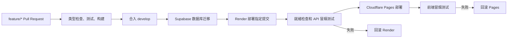

# 测试环境发布实施计划

本计划实现一套由 `develop` 驱动、使用免费套餐的共享测试环境。部署拓扑和取舍见 [ADR-0025](./adr/0025-test-environment-hosting-topology.md)。

## 目标

- Cloudflare Pages 部署 Vite 前端。
- Render 免费 Web Service 部署单实例 Node.js 后端。
- Supabase 免费项目提供 PostgreSQL。
- Cloudflare Worker 定期访问后端进程存活接口，尽量降低 Render 休眠概率。
- Pull Request 通过质量检查后才能合入 `develop`。
- `develop` 检查通过后，由 GitHub Actions 串行执行数据库迁移、后端部署、前端部署和冒烟测试。
- 应用发布失败时自动恢复上一版应用，数据库迁移不自动逆转。

## 不在第一版范围内

- 用户登录和 API 鉴权。
- feature/PR 预览环境。
- 运行日志持久化。
- 后端 24 小时在线保证或冷启动交互优化。
- 桩实例运行意图持久化和发布后自动恢复。
- 固定出口 IP、生产级数据库备份和外部消息通知。

## 发布链路



## 实施步骤

### 1. 配置跨来源 API 地址

先为前端 API 地址解析编写单元测试，再实现统一的 URL 构造入口。

- 新增 `VITE_API_BASE_URL`，生产构建使用 Render 的 `onrender.com` 地址。
- 本地开发未配置该变量时继续使用相对路径 `/api` 和 Vite proxy。
- 所有 `fetch` 和 `EventSource` 统一经过同一个 API URL 析构函数，避免普通请求与 SSE 配置漂移。
- 后端新增 `CORS_ALLOWED_ORIGIN`，测试环境只允许 Pages 的正式 `pages.dev` 地址；本地默认允许 `http://localhost:3001`。
- CORS 不是鉴权，Render API 仍然公开。

验证：

- 单元测试覆盖空基础地址、带或不带末尾斜杠的 Render 地址、普通 API 和 SSE URL。
- 后端测试覆盖允许来源、非允许来源和预检请求。
- 本地 `pnpm dev` 仍可通过 `/api` proxy 工作。

### 2. 增加依赖就绪检查

保留 `/api/health` 作为进程存活检查，新增 `/api/ready`：

- 对 Supabase 执行最小只读查询，例如 `select 1`。
- 数据库可用时返回 `200`；不可用或未配置时返回 `503`。
- 按后端 API 文档规范提供中文 `summary`、`description`、响应说明和字段说明。

验证：

- 先写数据库成功与失败测试，再实现 route。
- 测试 `/api/openapi.json` 包含 `/api/ready` 和重要中文说明。
- Render 的平台健康检查使用 `/api/health`；发布工作流使用 `/api/ready`。

### 3. 准备 Cloudflare Pages 静态部署

- 在 `apps/web` 保存 Pages/Wrangler 非敏感配置，项目建议命名为 `sparkbee-test-web`。
- 构建命令使用 `pnpm --filter @spark-bee/web build`，产物目录为 `apps/web/dist`。
- 在 `apps/web/public/_redirects` 添加 SPA fallback，使 `/charging-points` 和详情页刷新时返回 `index.html`。
- 不配置 Pages Functions，不代理 `/api`。
- GitHub Actions 使用 Wrangler Direct Upload，并明确部署为 `develop` 对应的 production deployment。

验证：

- `pnpm --filter @spark-bee/web build` 成功。
- `dist/_redirects` 存在。
- Pages 的 `/`、`/charging-points` 和静态资源均返回成功响应。

### 4. 准备 Render 服务

在仓库根目录增加 `render.yaml`，建议服务名为 `sparkbee-test-api`：

- `type: web`、Node runtime、`plan: free`、`region: singapore`。
- 关联 `develop`，关闭 Render 自己的自动部署，由 GitHub Actions Deploy Hook 触发。
- Node.js 版本固定为仓库 `.nvmrc` 的 24。
- 构建时安装锁定依赖；启动命令使用现有 `pnpm --filter @spark-bee/server start`。
- 平台健康路径为 `/api/health`。
- `NODE_ENV=production`。
- 运行日志目录放在临时目录；重新部署、重启或休眠后允许丢失。

Render 环境变量：

- `DATABASE_URL`：Supabase Session pooler 连接串。
- `CORS_ALLOWED_ORIGIN`：Pages 正式测试环境地址。
- `CHARGING_POINT_RUNTIME_LOG_DIRECTORY`：Render 临时目录。

验证：

- 使用 Render Blueprint 校验能力检查 `render.yaml`。
- 首次部署后 `/api/health` 可唤醒服务并最终返回 `200`。
- `/api/ready` 能连接 Supabase。
- 跨来源普通请求和 SSE 均可工作。

### 5. 建立 Pull Request 质量门禁

新增 PR 工作流，触发范围为目标分支 `develop`：

1. 使用 Node.js 24 和 pnpm 10.23.0。
2. `pnpm install --frozen-lockfile`。
3. `pnpm typecheck`。
4. `pnpm test`。
5. `pnpm build`。

在 GitHub branch protection 中：

- 禁止直接推送 `develop`。
- 要求通过 Pull Request 合并。
- 将类型检查、测试和构建设为 required checks。

feature 分支只执行质量检查，不部署任何环境。

### 6. 建立测试环境发布工作流

发布工作流只处理通过质量检查的 `develop` 提交，并部署精确的 commit SHA。

1. 获取当前 Render 和 Pages production deployment ID，作为可能的回滚目标。
2. 使用 Supabase 数据库 Secret 执行 `pnpm db:migrate`。
3. 通过 Render Deploy Hook 部署当前 SHA，并通过 Render API 轮询部署状态。
4. 轮询 `/api/ready`，随后请求桩实例列表 API。
5. 使用 Wrangler 将 `apps/web/dist` 上传到 Pages。
6. 请求 Pages `/charging-points`，验证页面可访问。
7. 写入 GitHub Actions Summary，列出每一步结果和环境地址。

失败处理：

- 迁移失败：停止，不部署应用。
- Render 部署、就绪检查或 API 冒烟失败：调用 Render Rollback API 恢复上一成功部署，不发布 Pages。
- Pages 部署后前端冒烟失败：调用 Cloudflare Pages Rollback API 恢复上一 production deployment。
- 不执行数据库 down migration；所有迁移必须保持上一版后端可运行。

并发策略：

- 质量检查允许取消已过时的运行。
- 迁移和部署使用独立 concurrency group，`cancel-in-progress: false`。
- 已进入迁移的发布不得被新提交中断，后续发布排队。

### 7. 配置 GitHub test Environment

建议将平台凭据放入 GitHub Environment `test`，而不是普通仓库变量。

Secrets：

- `SUPABASE_DATABASE_URL`
- `RENDER_DEPLOY_HOOK_URL`
- `RENDER_API_KEY`
- `CLOUDFLARE_API_TOKEN`

Variables：

- `RENDER_SERVICE_ID`
- `RENDER_API_BASE_URL`
- `CLOUDFLARE_ACCOUNT_ID`
- `CLOUDFLARE_PAGES_PROJECT`
- `CLOUDFLARE_PAGES_URL`

任何工作流日志和 Summary 都不得输出连接串或 Token。

### 8. 首次发布与演练

1. 手工创建 Supabase、Render 和 Pages 免费资源，并填写 Secrets/Variables。
2. 校验 Render 与 Supabase 均选择新加坡区域。
3. 将本 feature 分支通过 PR 合入 `develop`。
4. 观察首次迁移、Render 部署、Pages 部署和冒烟测试。
5. 创建一个桩实例并验证页面刷新后数据仍存在。
6. 验证普通 API、SSE 和连接测试 CSMS 的 OCPP WebSocket。
7. 触发一次应用层失败演练，确认 Render 或 Pages 可以恢复上一版。
8. 确认 Render 发布会断开运行中的桩实例，发布后手工重新启动。

## 测试环境保活探测

`apps/keepalive-worker` 是独立的 Cloudflare Worker，只实现 Cron `scheduled` 处理器，不提供公共 HTTP 接口。它使用 `*/14 * * * *` 调度访问 `HEALTH_URL=https://sparkbee-test-api.onrender.com/api/health`，请求超时为 90 秒，仅把 `2xx` 视为成功，并为成功或失败输出结构化日志。单次失败不立即重试，等待下一次 Cron。

该 Worker 不纳入测试环境 GitHub Actions，只在首次建立资源时从仓库手动部署一次：

```bash
pnpm --filter @spark-bee/keepalive-worker run deploy
```

保活探测会让单个 Render 免费实例在完整月份内消耗约 720 至 744 个实例小时，接近每个工作区每月 750 个免费实例小时。该机制只降低冷启动概率，不承诺 Render 永不休眠。

## 完成标准

- `develop` 无法绕过 PR 和 required checks 直接更新。
- feature/PR 不创建预览环境。
- `develop` 的合格提交自动且串行发布。
- 数据库迁移失败能够阻止应用发布。
- `/api/health` 与 `/api/ready` 分工明确。
- Pages 前端能直接调用 Render API，并正常接收 SSE。
- 应用冒烟失败能够恢复上一版；数据库迁移不会被自动逆转。
- 日常发布保留 Supabase 数据。
- GitHub Actions Summary 能独立说明发布结果，不依赖外部通知渠道。
- Cloudflare Worker 已按 14 分钟最大间隔执行测试环境保活探测，且不访问数据库就绪接口。
- 已知免费套餐限制、公开访问、日志丢失和桩实例断开均与 ADR 一致。

## 官方参考

- [Cloudflare Pages Direct Upload](https://developers.cloudflare.com/pages/get-started/direct-upload/)
- [Cloudflare Pages 与 GitHub Actions](https://developers.cloudflare.com/pages/how-to/use-direct-upload-with-continuous-integration/)
- [Cloudflare Pages Rollback API](https://developers.cloudflare.com/api/resources/pages/subresources/projects/subresources/deployments/methods/rollback/)
- [Cloudflare Cron Triggers](https://developers.cloudflare.com/workers/configuration/cron-triggers/)
- [Render 免费服务限制](https://render.com/docs/free)
- [Render Deploy Hooks](https://render.com/docs/deploy-hooks)
- [Render Rollbacks](https://render.com/docs/rollbacks)
- [Render Blueprint 规范](https://render.com/docs/blueprint-spec)
- [Supabase PostgreSQL 连接方式](https://supabase.com/docs/guides/database/connecting-to-postgres)
